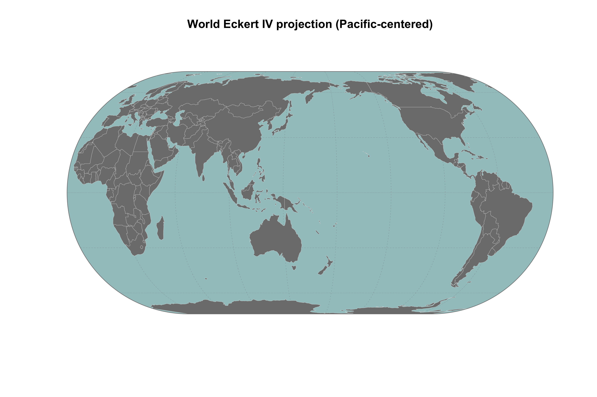

<!-- README.md is generated from README.Rmd. Please edit that file -->

# robinmap

<!-- badges: start -->

[](https://choosealicense.com/licenses/gpl-2.0/)
[](https://lifecycle.r-lib.org/articles/stages.html#stable)
[](https://www.repostatus.org/#active)
<!-- badges: end -->

The goal of the R package `robinmap` is to map World countries in the
Robinson projection system (or others CRS) and centered on a different
meridian than Greenwich. It uses the [Natural
Earth](https://www.naturalearthdata.com/) layer as a base map.




## Installation

You can install the development version from
[GitHub](https://github.com/) with:

``` r
# install.packages("remotes")
remotes::install_github("FRBCesab/robinmap")
```

Then you can attach the package `robinmap`:

``` r
library("robinmap")
```

## Usage

``` r
robinmap()
robinmap(center = 160)
```

## Citation

Please cite this package as:

> Casajus Nicolas (2022) robinmap: World Map in Pacific Centered
> Robinson Projection. R package version 0.0.0.9000.

## Code of Conduct

Please note that the `robinmap` project is released with a [Contributor
Code of
Conduct](https://contributor-covenant.org/version/2/0/CODE_OF_CONDUCT.html).
By contributing to this project, you agree to abide by its terms.
